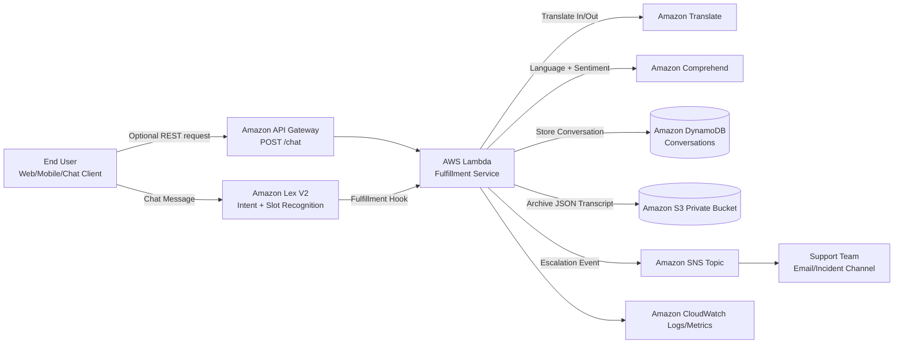

# Multilingual Customer Support Chatbot on AWS

Portfolio-ready AWS Solutions Architect Associate project that demonstrates a secure, serverless multilingual chatbot using:
- Amazon Lex V2
- AWS Lambda
- IAM (least privilege)
- Amazon Translate

Additional services used:
- Amazon API Gateway
- Amazon DynamoDB
- Amazon CloudWatch
- Amazon S3
- Amazon SNS
- Amazon Comprehend
- Terraform (Infrastructure as Code)

## 1. Business problem and use case
Global businesses receive support requests in different languages. Teams often need:
- Real-time intent recognition
- Translation between customer language and internal support language
- Automated case triage and escalation
- Auditable conversation storage for support quality

This project solves that by routing multilingual requests through Lex and Lambda, translating in/out of English, storing transcripts, and escalating negative sentiment interactions.

## 2. Architecture overview
1. User sends message through Lex (or API Gateway).
2. Lex resolves intent and calls Lambda fulfillment.
3. Lambda uses Comprehend for language/sentiment and Translate for text conversion.
4. Lambda writes conversation history to DynamoDB.
5. Lambda archives transcript payload in private S3.
6. Lambda sends escalation notifications to SNS for high-priority/negative sentiment.
7. CloudWatch captures logs and metrics.

## 3. Mermaid architecture diagram



## 4. AWS services and why used
- `Amazon Lex V2`: NLP, intent classification, slot elicitation, multilingual bot runtime
- `AWS Lambda`: Stateless fulfillment logic and service orchestration
- `IAM`: Service roles and least-privilege permissions boundaries
- `Amazon Translate`: Request/response translation across languages
- `Amazon Comprehend`: Dominant language and sentiment classification
- `Amazon DynamoDB`: Durable transcript and metadata storage with TTL
- `Amazon S3`: Long-term private transcript archive
- `Amazon SNS`: Escalation notifications for urgent interactions
- `Amazon API Gateway`: Optional external API channel for chatbot clients
- `Amazon CloudWatch`: Logs, metrics, observability, troubleshooting
- `Terraform`: Repeatable, auditable IaC for core stack

## 5. Repository structure

```text
aws-multilingual-support-chatbot/
├── README.md
├── pyproject.toml
├── .python-version
├── docs/
│   ├── deployment-guide.md
│   ├── testing-guide.md
│   ├── cleanup-guide.md
│   ├── saa-mapping.md
│   └── security-model.md
├── infra/
│   └── terraform/
│       ├── versions.tf
│       ├── providers.tf
│       ├── variables.tf
│       ├── main.tf
│       ├── iam.tf
│       ├── dynamodb.tf
│       ├── s3.tf
│       ├── sns.tf
│       ├── lambda.tf
│       ├── apigateway.tf
│       ├── lex.tf
│       ├── outputs.tf
│       └── terraform.tfvars.example
├── lambda/
│   └── fulfillment/
│       ├── app.py
│       └── requirements.txt
├── lex/
│   ├── intents-and-slots.md
│   └── alias-locale-settings.json
├── iam/
│   └── lambda-least-privilege-policy.json
└── scripts/
    └── create_lex_alias.sh
```

## 6. Setup instructions
1. Install tools:
   - Terraform >= 1.6
   - AWS CLI v2
   - `uv`
   - `jq`
2. Configure AWS credentials:
```bash
aws configure
```
3. Install Python tooling and dependencies:
```bash
uv sync --all-groups
```
4. Configure Terraform variables:
```bash
cd infra/terraform
cp terraform.tfvars.example terraform.tfvars
```

## Python quality commands
```bash
uv run ruff format lambda/fulfillment/app.py
uv run ruff check lambda/fulfillment/app.py
```

## 7. Deployment instructions
From `infra/terraform`:
```bash
terraform init
terraform plan
terraform apply
```
Capture outputs:
```bash
terraform output
```
Create Lex alias + attach Lambda hook:
```bash
cd ../../
chmod +x scripts/create_lex_alias.sh
./scripts/create_lex_alias.sh <LEX_BOT_ID> <LEX_BOT_VERSION> <LAMBDA_ARN> PROD
```
Detailed steps: [`docs/deployment-guide.md`](docs/deployment-guide.md)

## 8. Lex intents, slots, utterances, fulfillment
Implemented with Terraform resources in [`infra/terraform/lex.tf`](infra/terraform/lex.tf):
- Intents:
  - `CustomerSupportIntentEN`
  - `CustomerSupportIntentES`
  - `CustomerSupportIntentFR`
- Slot:
  - `SupportTopic` (required)
- Fulfillment:
  - Lambda code hook enabled per intent
- Required fallback intents per locale included

Full human-readable config: [`lex/intents-and-slots.md`](lex/intents-and-slots.md)

## 9. Translation support (3+ languages)
Supported user languages:
- English (`en`)
- Spanish (`es`)
- French (`fr`)

Flow:
- Input language detected via Comprehend (when text length allows)
- Input translated to English for processing
- Response translated back to user preferred language

## 10. Logging and monitoring
- Lambda logs to CloudWatch log group with retention policy
- API Gateway stage metrics enabled
- Operational metrics to watch:
  - Lambda `Errors`, `Duration`, `Throttles`
  - API Gateway `4XX/5XX`, latency
  - SNS delivery failures

## 11. Security implementation summary
- No hardcoded credentials
- IAM least privilege role/policies for Lambda and Lex
- Environment variables for runtime configuration
- CloudWatch logs enabled
- DynamoDB SSE enabled
- S3 bucket private with public access blocked

Detailed model: [`docs/security-model.md`](docs/security-model.md)

## 12. Test cases and sample conversations
See [`docs/testing-guide.md`](docs/testing-guide.md) for:
- Functional test cases
- API Gateway integration curl test
- Sample English/Spanish/French chatbot interactions
- Negative sentiment escalation validation

## 13. Cleanup instructions
See [`docs/cleanup-guide.md`](docs/cleanup-guide.md)

Quick cleanup:
```bash
cd infra/terraform
terraform destroy
```

## 14. AWS SAA exam concept mapping
See [`docs/saa-mapping.md`](docs/saa-mapping.md) for direct mapping to:
- Secure architectures
- Resilient architectures
- Cost-optimized architectures
- High-performing architectures
- Operational excellence

## 15. Three project extensions
1. Add Amazon Kendra for knowledge-base powered answers.
2. Add Step Functions for multi-step workflows (ticket creation, CRM updates, follow-up tasks).
3. Add Amazon Bedrock guardrailed response generation with human escalation fallback.
